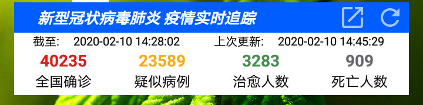
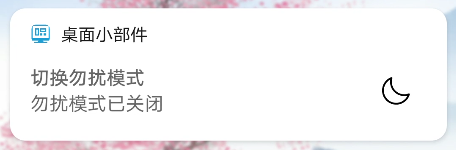

### Dawn-Desktop-Addons
### 曙光桌面小部件
An Android app provides a live wallpaper and some app widgets. Maintained by Dawncraft Studio.

一个提供了一个可加载模型的动态桌面壁纸和一些桌面小部件的安卓应用程序，由曙光工艺工作室维护。

## Features
## 特性
1. A live wallpaper that can render some custom models.(WIP)
   一个可加载自定义模型的动态壁纸(未完成)
2. An app widget that can show a sentence every day. 一个展示一言的桌面小部件, API可选择一言([Hitokoto](https://hitokoto.cn/))或曙光工艺服务器.
   
3. An app widget that can monitor Novel coronavirus pneumonia's statistics.The API comes from Tencent News.
   一个用于监测新型冠状病毒肺炎的桌面小工具，API来自于腾讯新闻
   
4. An app widget that can open/close zen mode.
   一个用于开启或关闭勿扰模式的锁屏通知
   
5. A quick setting that can enable or disable 5G.(Only can be used on XiaoMi)
   一个用于开关5G的快捷开关(只能用于小米/红米手机, 华为/荣耀在授予权限的前提下能显示5G状态, 但无法切换, 除非root并作为系统应用安装, 其他手机等待适配中)
6. A quick setting that can show layout borders.(WIP)
   一个用于开启或关闭开发者选项中显示布局边界选项的快捷开关(开发中，目前版本需要root)

## Bugs
1. 各种bug

## TODO
1. 修改或删除句子
2. UI全面使用Google Material Design并适配暗黑模式
3. 在Android 12上首次添加小部件时使用默认配置, 无需手动配置

## 测试机型
- HM Note 1S(Android4.4.4/MIUI9.2稳定版) 新冠肺炎小部件可用(由old-android分支维护)
- ASUS Z010DA(Android5.0.2) 新冠肺炎小部件可用
- Samsung Galaxy Note4(Android6.0.1) 新冠肺炎小部件可用
- HUAWEI 畅享7 Plus(Android7.0/EMUI5.1.3) 完全可用
- OPPO A7(Android8.1.0/ColorOSV5.2) 完全可用
- Honor 30(Android10/MagicUI4.0.0) 完全可用
- Honor 30(HarmonyOS 2.0.0) 完全可用

另外如果隐藏了桌面图标，可以通过以下命令打开设置界面：
```bash
adb shell
am start -n io.github.dawncraft.desktopaddons/io.github.dawncraft.desktopaddons.ui.MainActivity
```
用以下命令显示桌面小部件的ID
```bash
adb shell dumpsys appwidget
```
用以下命令刷新所有桌面小部件(需要root或模拟器)
```bash
adb shell
su
am broadcast -a android.intent.action.MY_PACKAGE_REPLACED -n io.github.dawncraft.desktopaddons/io.github.dawncraft.desktopaddons.broadcast.PackageBroadcastReceiver
```

## 特别致谢
1. 所有在疫情中奉献自己的医护人员
2. 腾讯新闻API
3. 感谢[FiveGSwitcher](https://github.com/ysy950803/FiveGSwitcher)为5G快捷开关功能提供的思路

## 更新日志
懒得写了...
